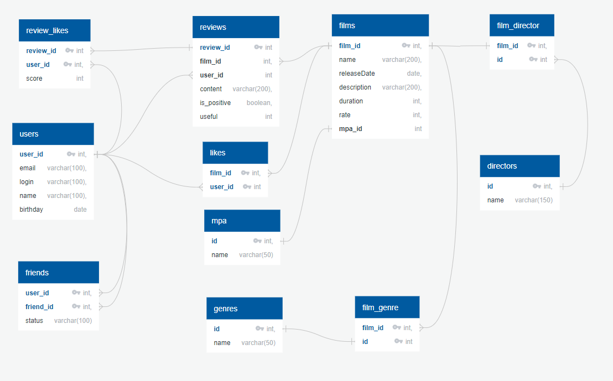

# java-filmorate
Template repository for Filmorate project.

+ __films - film_genre:__ у одного фильма может быть много записей в жанрах (по тз)

+ __film_genre - genre:__ многие ко многим

+ __films - mpa:__ один к одному

+ __films - likes:__ один ко многим (один фильм много лайков от юзеров)

+ __users - likes:__ один ко многим (один юзер много лайков к фильмам)

+ __users - friends:__ один ко многим (один юзер много друзей)

  + причем в таблице friends внешние ключи на таблицу users у обоих полей (user_id, friend_id)
+ __directors:__ один ко многим (один режиссёр снял много фильмов)
+ __film_director:__ многие ко многим
+ __reviews:__ один ко многим
+  __reviews_likes:__ многие ко многим

## Список функциональностей
В рамках группового проекта (ФЗ 12) были реализованы следующие функции:
​
1. Функциональность «Отзывы» (ветка add-reviews)
2. Функциональность «Поиск» (ветка add-search)
3. Функциональность «Рекомендации» (ветка add-recommendations)
4. Добавление режиссёров в фильмы (ветка add-director)
5. Удаление фильмов и пользователей (ветка add-remove-endpoint)
6. Функциональность «Общие фильмы» (ветка add-common-films)
7. Вывод самых популярных фильмов по жанру и годам (ветка add-most-populars)